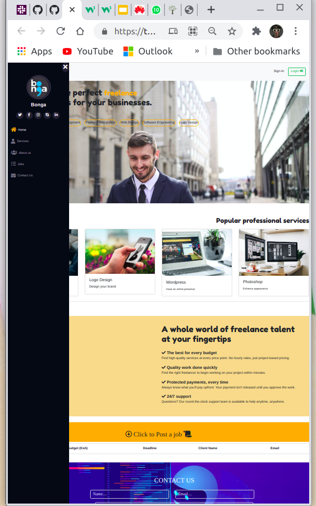

# BONGA
A website that helps users needs by connecting them to different developer, UX and GUI designers.
## Description
The  Purpose of this  site  was to  provide  a platform where  developers can showcase their  works, meet  other developers and also get  freelance and paying  Jobs from users within  and outside the community. 
All  the user has to  do is sign in.
## Setup/Installation Requirements
* git clone https://github.com/ThiraTheNerd/bonga.git on your terminal.
* Navigate to the bonga folder.
* Open the folder in your editor.
* To be able to leave messages users are encouraged to sign in. 
# Screenshot of Webpage
 
## Technologies Used
The technologies used to build this application are :
1. HTML 
2. CSS 
3. Javascript 
4. jQuerry. 
5. BootStrap
## Aditional Resources
* "https://kit.fontawesome.com/12e6ee6b0e.js" - for  different  font  styles .
* https://chimpstatic.com/mcjs-connected/js/users/ea3a90777ca5a97ecea842a16/4fec03ceaeeaf06e289dfdc3c.js") for hosting  our email.
* https://jquery.com/  for troubleshooting 
## Support and contact details
  #git hub:
  https://github.com/ThiraTheNerd/ 
  https://github.com/Natasha1594
  https://github.com/Alicia-krynne
## FAQ
**How Does the  form collect data?**

Answer: Upon clicking  “click to post “ a form  drops down  allowing the user  to  fill in their details including the job  description  and deadline. 
The information is then  tallied on  a separate  table for  other users  who  visit.

## Contributors
**@ThiraTheNerd
**@Alicia-krynne
**@Natasha1594

### License
*MIT License
## ACKNOWLEMENTS ##
 A pat  on the back for this wonderful team that  has dedicated their time and skills intomaking this website responsive and apealing at the sametime.

